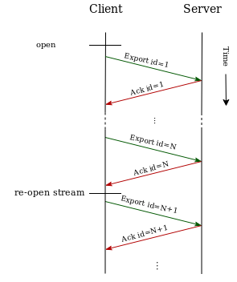

# OpenTelemetry Protocol Specification

_Author: Tigran Najaryan, Omnition Inc._

_Status: Draft._

OpenTelemetry Protocol (OTLP) specification describes the encoding, transport and delivery mechanism of telemetry data between telemetry sources, intermediate nodes such as collectors and telemetry backends.

## Table of Contents

- [Motivation](#motivation)
- [Protocol Details](#protocol-details)
  - [Hello Handshake](#hello-handshake)
  - [Export Request and Response](#export-request-and-response)
  - [Client Modes](#client-modes)
  - [Server Response](#server-response)
  - [gRPC Transport](#grpc-transport)
  - [Other Transports](#other-transports)
- [Implementation Recommendations](#implementation-recommendations)
  - [Pipelined Mode](#pipelined-mode)
  - [Multi-Destination Exporting](#multi-destination-exporting)
- [Trade-offs and Mitigations](#trade-offs-and-mitigations)
- [Future Versions and Interoperability](#future-versions-and-interoperability)
- [Prior Art, Alternatives and Future Possibilities](#prior-art-alternatives-and-future-possibilities)
- [Open Questions](#open-questions)
- [Appendix A - Protocol Buffer Definitions](#appendix-a---protocol-buffer-definitions)
- [Appendix B - Performance Benchmarks](#appendix-b---performance-benchmarks)
- [Glossary](#glossary)
- [Acknowledgements](#acknowledgements)
- [Author's Address](#authors-address)


## Motivation

OTLP is a general-purpose telemetry data delivery protocol designed in the scope of OpenTelemetry project. It is an incremental improvement of OpenCensus protocol. Compared to OpenCensus protocol OTLP has the following improvements:

- Ensures high reliability of data delivery and clear visibility when the data cannot be delivered. OTLP uses acknowledgements and retry mechanisms to implement reliable delivery.

- It is friendly to Level 7 Load Balancers and allows them to correctly map imbalanced incoming traffic to a balanced outgoing traffic. This allows to efficiently operate large networks of nodes where telemetry data generation rates change over time.

- Allows backpressure signalling from telemetry data destinations to sources. This is important for implementing reliable multi-hop telemetry data delivery all the way from the source to the destination via intermediate nodes, each having different processing capacity and thus requiring different data transfer rates.

## Protocol Details

OTLP defines the encoding of telemetry data and the protocol used to exchange data between the client and the server.

This specification defines how OTLP is implemented over [gRPC](https://grpc.io/) and specifies corresponding [Protocol Buffers](https://developers.google.com/protocol-buffers/docs/overview) schema. Future extensions to OTLP may define implementations over other transports. For details of gRPC service definition see section [gRPC Transport](#grpc-transport).

OTLP is a request/response style protocols: the clients send requests, the server replies with corresponding responses. There are 2 supported requests and response types: `Hello` and `Export`.

### Hello Handshake

The message exchange between the client and server SHOULD start by the client initiating the underlying transport and sending `Hello` request. The server replies with `Hello` response. `Hello` request and response have no payload in this version of OTLP. They are intended to be extended in the future with a payload that describes client's and server's extended capabilities when such new capabilities are added to the protocol. The initial exchange of `Hello` messages is a handshake that allows client and server to discover each other's capabilities in a backwards compatible manner (see more about how future versions of the protocol will ensure interoperability in a separate section below).

The client MAY choose to avoid sending `Hello` request and proceed to sending `Export` requests immediately after the transport is established (see the next section for `Export` description). From the server's perspective this behavior should be equivalent to a successful exchange of  `Hello` request and response with empty payloads.

The server MUST always reply with a corresponding `Hello` response to every `Hello` request.

### Export Request and Response

After `Hello` request and response the client starts sending telemetry data using `Export` requests.  The client continuously sends a sequence of `Export` requests to the server and expects to receive a response to each request:


`Export` request contains telemetry data and includes an ID field that is unique for each request. The value of ID field is a sequential uint64 number generated by the client. `Export` response received from the server contains an ID field that acknowledges the receipt of the request with the same ID value.

_Note: this protocol is concerned with reliability of delivery between one pair of client/server nodes and aims to ensure that no data is lost in-transit between the client and the server. Many telemetry collection systems have multiple nodes that the data must travel across until reaching the final destination (e.g. application -> agent -> collector -> backend). End-to-end delivery guarantees in such systems is outside of the scope of OTLP. The acknowledgements described in this protocol happen between a single client/server pair and do not span multiple nodes in multi-hop delivery paths._

### Client Modes

OTLP defines 2 modes of operation for clients: Synchronous and Pipelined.

Synchronous mode is simpler to implement and provides good performance in sub-millisecond latency networks, at the cost of worse throughput in high latency networks.

Pipelined mode requires somewhat more complicated implementation but provides significantly better throughput on high latency networks. 

Clients may choose to implement either Synchronous or Pipelined mode (or both if desired).

The choice of client mode does not affect the server behavior. OTLP implementation does not require the server to be aware of the mode used by the client. Clients operating in different modes can connect to the same server and even switch the mode to a different one during the connection session without requiring any special arrangement on the server side or in intermediary network hops such as load balancers.

#### Synchronous

In Synchronous mode after sending the request the client MUST wait until the response is received from the server. There can be at most only one request in flight that is not yet acknowledged by the server. The server MUST reply with `Export` response that includes the ID of the last request. Until such response or an error from underlying transport layer is received the client MUST NOT send any other requests.


Synchronous mode is recommended when simplicity of implementation is desirable and when the client and the server are connected via very low-latency network, such as for example when the client is an instrumented application and the server is a OpenTelemetry Service running as as a local daemon.

The maximum achievable throughput in synchronous mode is `max_request_size / (network_latency + server_response_time)`. For example if the request can contain at most 100 spans, network roundtrip latency is 200ms and server response time is 300 ms, then the maximum achievable throughput is `100 spans / (200ms+300ms)` or 200 spans per second. It is easy to see that in high latency networks or when the server response time is high it is difficult to achieve good throughput unless requests are very big (even when client, server and network throughput potentially allow much bigger processing rate).

#### Pipelined

In Pipelined mode the client may send multiple `Export` requests without waiting for the response to the earlier sent requests, essentially creating a pipeline of requests that are currently in flight that are not acknowledged. The server MUST respond to each `Export` request with a corresponding response that includes the ID of the request. Note that the order of IDs in a sequence of responses coming from the server may be different than the order of IDs in a sequence of earlier sent requests coming from the client. The client MUST be able to correctly process such out-of-order responses.


The number of unacknowledged requests for which the client did not receive responses yet is defined by the window size of underlying transport (for gRPC see details about [how the window size is calculated](https://grpc.io/blog/2017-08-22-grpc-go-perf-improvements/)).

If the client detects that the underlying transport is broken and must be re-established the client MUST retry sending all requests that are still pending acknowledgement after re-establishing the transport. If the client is shutting down (e.g. when the containing process wants to exit) the client MUST wait until all pending acknowledgements are received or until an implementation specific timeout expires. This ensures reliable delivery of telemetry data.

If the client is unable to deliver a certain request (e.g. it retried but failed multiple times or shutdown timer expired while waiting for acknowledgements) the client SHOULD record the fact that the data was not delivered.

Pipelined mode is recommended when the client and the server are connected via a high-latency network but high throughput is still required. This is a typical situation when the client is an application running in one data center and the server is a telemetry backend running in a different data center, potentially in a completely different geography that is reachable via high-latency multi-hop network. Same recommendation applies to low latency networks if the server is capable of high processing rate but takes a long time to generate a response to each particular request.

Note that the server does not need to know in what mode the client operates. The server just needs to ensure that it sends a response to every request. The Synchronized or Pipelined mode is enabled purely by client behavior.

### Server Response

The Server replies to every `Export` request received from the client by a corresponding `Export` response. The ID field of the response is set equal to the ID field of the request.

#### Result Code

`Export` response includes a `result_code` field, which indicates whether the server was able to successfully process the received data. Possible values for `result_code` field are:

- `Success` - telemetry data is successfully processed by the server.

- `FailedNoneRetryable` - processing of telemetry data failed. The client MUST NOT retry sending the same telemetry data. The telemetry data MUST be dropped. This for example can happen when the request contains bad data and cannot be deserialized or otherwise processed by the server. The client SHOULD maintain a counter of such dropped data.

- `FailedRetryable` - processing of telemetry data failed. The client SHOULD record the error and may retry exporting the same data. This can happen when the server is temporarily unable to process the data.

#### Throttling

OTLP allows backpressure signalling.

If the server is unable to keep up with the pace of data it receives from the client then it SHOULD signal that fact to the client. The client MUST then throttle itself to avoid overwhelming the server.

`Export` response includes a `throttle_period_millisec` field, which indicates the minimum duration in milliseconds that the client MUST wait before sending the next `Export` request. The waiting period starts from the moment the client receives such `Export` response. The value of 0 for `throttle_period_millisec` indicates that the client may send the next `Export` request immediately and is an indication that no throttling is requested by the server.

This field is used by the server to signal backpressure to the client. The value of `throttle_period_millisec` is determined by the server and is implementation dependant. The server SHOULD choose a `throttle_period_millisec` value that is big enough to give the server time to recover, yet is not too big to cause the client to drop data while it is throttled.

### gRPC Transport

#### Service Definition

`Hello` request and response is done via a unary gRPC call.

`Export` requests and responses are delivered using bidirectional gRPC streams.

This is OTLP over gRPC Service definition:

```
service StreamExporter {
  // Hello handshake.
  rpc Hello(HelloRequest) returns (HelloResponse) {}

  // Sends a batch of telemetry data.
  rpc Export(stream ExportRequest) returns (stream ExportResponse) {}
}
```

Appendix A contains Protocol Buffer definitions for `HelloRequest`, `HelloResponse`, `ExportRequest` and `ExportResponse`.

#### Load Balancing

OTLP utilizes gRPC stream in a way that allows Level 7 load balancers that may be in the network path between the client and the server to re-balance the traffic periodically. This is necessary so that the traffic is not pinned by the load balancer to one server for the entire duration of telemetry data sending, thus potentially leading to imbalanced load of servers located behind the load balancer.

OTLP achieves this by periodically closing and reopening the gRPC stream. This behavior is based on the fact that Level 7 load balancers that are gRPC-aware (such as Envoy) make re-balancing decisions when a new stream is opened.



The client will periodically close and re-open the stream to help Load Balancers to re-balance the traffic.

Client MUST re-open the stream after sending an `Export` request if any  of these conditions is true:

- Time passed since the stream was last opened is longer than a user-configurable re-balancing period. Default re-balancing period should be 30 seconds with 5 seconds of random jitter.

- Number of batches exported since the stream was last opened is greater than user-configurable batch limit. Default batch limit should be 1000 batches with 200 batches of random jitter.

Note that in Pipelined mode the client MUST continue processing responses that the server may send to a stream that is closed from the client side until that stream is closed from the server side as well. This means that during this transition there may exist more than one stream of data between the client and the server.

The default recommended time duration after which the stream is reopened is about 30 seconds. Client implementations may expose this duration as a configuration parameter.

Below is a example of how the reference implementation behaves when multiple clients send data via load balancer to one server and one more server is added to the load balancer at some point in time. The horizontal axis is time in minutes, the vertical axis is telemetry data receiving rate by servers:


In this chart initially the entire traffic is handled by one server (green line), then a second server is attached to Load Balancer (blue chart) and we can see that the total traffic is rebalanced and split evenly between the servers.

### Other Transports

OTLP can work over any other transport that supports message request/response capabilities. Additional transports supported by OTLP can be specified in future RFCs that extend OTLP.

## Implementation Recommendations

### Pipelined Mode

Typical client implementation of Pipelined mode will contain an `AckPending` map of requests that were sent to the server but which are not yet acknowledged by the server. For every response received from the server the client will lookup in `AckPending` the corresponding request using the ID field of response and will remove it from the map.

If the client shuts down before receiving acknowledging responses from the server or otherwise has to discard the requests that are in `AckPending` it may assume that telemetry data contained in these requests is lost. Client will typically maintain a counter of lost telemetry data.

### Multi-Destination Exporting

When the telemetry data from one client must be sent to more than one destination server there is an additional complication that must be accounted for. When one of the servers acknowledges the data and the other server does not (yet) acknowledges the client needs to make a decision about how to move forward.

In such situation the the client SHOULD implement queuing, acknowledgement handling and retrying logic per destination. This ensures that servers do not block each other. The queues SHOULD reference shared, immutable data to be sent, thus minimizing the memory overhead caused by having multiple queues.


This ensures that all destination servers receive the data regardless of their speed of reception (within the available limits imposed by the size of the client-side queue).

## Trade-offs and mitigations

### Request Acknowledgements

#### Implementation Complexity

The addition of acknowledgements provides delivery guarantees however it comes at the cost of slightly increased processing overhead and complexity of implementation.

#### Duplicate Data

In edge cases (e.g. on reconnections, network interruptions, etc) the client has no way of knowing if recently sent data was delivered if no acknowledgement was received yet. The client will typically choose to re-send such data to guarantee delivery, which may result in duplicate data on the server side. This is a deliberate choice and is considered to be the right tradeoff for telemetry data.

### Client Mode

Clients that want to avoid complex implementations can choose to implement Synchronous mode only.

## Future Versions and Interoperability

OTLP will evolve and change over time. Future versions of OTLP must be designed and implemented in a way that ensures that clients and servers that implement different versions of OTLP can interoperate and exchange telemetry data. Old clients must be able to talk to new servers and vice versa. If new versions of OTLP introduce new functionality that cannot be understood and supported by nodes implementing the old versions of OTLP the protocol must regress to the lowest common denominator from functional perspective.

When possible the interoperability SHOULD be ensured between all versions of OTLP that are not declared obsolete.

OTLP does not use explicit protocol version numbering. OTLP's interoperability of clients and servers of different versions is based on the following concepts:

1. OTLP (current and future versions) defines a set of capabilities, some of which are mandatory, others are optional. Clients and servers must implement mandatory capabilities and can choose implement only a subset of optional capabilities.

2. For minor changes to the protocol future versions and extension of OTLP are encouraged to use the ability of Protocol Buffers to evolve message schema in backwards compatible manner. Newer versions of OTLP may add new fields to messages that will be ignored by clients and servers that do not understand these fields. In many cases careful design of such schema changes and correct choice of default values for new fields is enough to ensure interoperability of different versions without nodes explicitly detecting that their peer node has different capabilities.

3. More significant changes must be explicitly defined as new optional capabilities. Such capabilities SHOULD be discovered by client and server implementations during `Hello` handshake. The capabilities SHOULD be described by the payload contained in `Hello` request and response. The mandatory capabilities defined by this specification are implied and SHOULD not be explicitly encoded in the `Hello` payload. A future implementation of OTLP that wants to use a certain optional capability SHOULD use `Hello` handshake to announce its capabilities and discover capabilities of the peer and adjust its behavior to match the expectation of a peer that does not support a particular capability.

The current version of OTLP is the initial version that describes mandatory capabilities only. Implementations of this specification SHOULD NOT attempt to detect the capabilities of their peers and should operate as defined in this document.

## Prior Art, Alternatives and Future Possibilities

OTLP is an evolution of OpenCensus protocol based on the research and testing of its modifications in production at Omnition. The modifications include the addition of delivery acknowledgements and changes that make the protocol load-balancer friendly.

OTLP uses Protocol Buffers for data encoding. Two other encodings were considered as alternative approaches: FlatBuffers and Capnproto. Both alternatives were rejected. FlatBuffers was rejected because it lacks required functionality in all languages except C++, particularly lack of verification of decoded data and inability to mutate in-memory data. Capnproto was rejected because it is not yet considered production ready, the API is not yet stable and like FlatBuffers it lacks ability mutate in-memory data.

Both FlatBuffers and Capnproto are worth to be re-evaluated for future versions of OpenTelemetry protocol if they overcome currently known limitations.

It is also worth researching transports other than gRPC. Other transports are not included in this RFC due to time limitations.

Experimental implementation of OTLP over WebSockets exists and was researched as an alternate. WebSockets were not chosen as the primary transport for OTLP due to lack or immaturity of certain capabilities (such as [lack of universal support](https://github.com/gorilla/websocket#gorilla-websocket-compared-with-other-packages) for [RFC 7692](https://tools.ietf.org/html/rfc7692) message compression extension). Despite limitations the experimental implementation demonstrated good performance and WebSocket transport will be considered for inclusion in a future OTLP Extensions RFC.

## Open Questions

One of the goals for telemetry protocol is reducing CPU usage and memory pressure in garbage collected languages. These goals were not addressed as part of this RFC and remain open. One of the promising future ways to address this is finding a more CPU and memory efficient encoding mechanism.

Another goal for telemetry protocol is achieving high compression ratios for telemetry data while keeping CPU consumption low. OTLP uses compression provided by gRPC transport. No further improvements to compression were considered as part of this RFC and are a future area of work.

## Appendix A - Protocol Buffer Definitions

This is Protocol Buffers schema for `Export` request and response:

```
// Hello is the first request from client to server.
message HelloRequest {
    // Empty in initial version of OTLP.
}

// Response to Hello request.
message HelloResponse {
    // Empty in initial version of OTLP.
}

// A request from client to server containing telemetry data to export.
message ExportRequest {
  // Unique sequential ID generated by the client.
  uint64 id = 1;

  // Telemetry data.
  repeated NodeSpans nodeSpans = 2;
  repeated NodeMetrics nodeMetrics = 3;
}

// A response to ExportRequest.
message ExportResponse {
  // ID of a response that the server acknowledges.
  uint64 id = 1;

  enum ResultCode {
    // Telemetry data is successfully processed by the server.
    Success = 0;
    
    // processing of telemetry data failed. The client MUST NOT retry 
    // sending the same telemetry data. The telemetry data MUST be dropped. 
    // This for example can happen when the request contains bad data and 
    // cannot be deserialized or otherwise processed by the server.
    FailedNoneRetryable = 1;
    
    // Processing of telemetry data failed. The client SHOULD record the 
    // error and may retry exporting the same data after some time. This 
    // for example can happen when the server is overloaded.
    FailedRetryable = 2;
  }
  ResultCode result_code = 2;

  // How long the client must wait before sending the next ExportRequest. 0 indicates
  // that the client doesn't need to wait.
  uint32 throttle_period_millisec = 3;
}

// A list of spans from a Node.
message NodeSpans {
  Node node = 1;
  Resource resource = 2;
  repeated Span spans = 3;
}

// A list of metrics from a Node.
message NodeMetrics {
  Node node = 1;
  Resource resource = 2;
  repeated Metric metrics = 3;
}
```

`Span`, `Metric`, `Node` and `Resource` schema definitions are defined in RFC (RFC number to be defined and linked from here).

## Appendix B - Performance Benchmarks

Benchmarking of OTLP vs other telemetry protocols was done using [reference implementation in Go](https://github.com/tigrannajaryan/exp-otelproto). In this OTLP implementation telemetry data, particularly Span batches are represented using a slightly modified Protocol Buffers schema taken from OpenCensus Protocol. Primary differences from OpenCensus schema are:

- Eliminated TruncatableString and replaced by plain string.
- Eliminated AttributesMap structure and used a map directly instead.
- Replaced google.protobuf.Timestamp by int64 timestamp in Unix epoch nanoseconds.

### OTLP vs OpenCensus

Benchmarks show that OTLP has about the same CPU consumption as OpenCensus. The overhead in OTLP coming from additional functionality is negligible.

### Throughput - Synchronous vs Pipelined Modes

Pipelined mode shows the following throughput advantage in benchmarks compared to Synchronous mode for various values of network roundtrip latency: 

```
+-----------+-----------------------+
+ Latency   | Pipelined/Synchronous |
+           |   Throughput Factor   |
+-----------+-----------------------+
+   0.02 ms |          1.4          |
+   2 ms    |          1.6          |
+  20 ms    |          2.7          |
+ 200 ms    |          6.5          |
+-----------+-----------------------+
```

Benchmarking is done using Export requests each carrying 500 spans, each span containing 10 small attributes.

### CPU Usage - gRPC vs WebSocket/Experimental

Experimental implementation using WebSocket transport demonstrated about 30% less CPU usage on small batches compared to gRPC transport and about 7% less CPU usage on large batches.

This shows that exploring different transports with less overhead is a promising future direction.

### Benchmarking Raw Results

The following is the benchmarking result, running on on a system with i7 7500U processor, 16 GB RAM. (Note that the benchmarking script sets "performance" CPU governor during execution and sets nice value of the process for more consistent results).

```
====================================================================================
Legend:
GRPC/OpenCensus             - OpenCensus protocol, streaming, not load balancer friendly, without ack
GRPC/OpenCensusWithAck      - OpenCensus-like protocol, streaming, not load balancer friendly, with ack
GRPC/Unary                  - GRPC, unary request per batch, load balancer friendly, with ack
GRPC/Stream/NoLB            - GRPC, streaming, not load balancer friendly, with ack
GRPC/Stream/LBAlways/Sync   - GRPC, streaming, load balancer friendly, close stream after every batch, with ack
GRPC/Stream/LBTimed/Sync    - OTLP Synchronous. GRPC, streaming, load balancer friendly, close stream every 30 sec, with ack
GRPC/Stream/LBTimed/Async   - OTLP Pipelined. GRPC, streaming, load balancer friendly, close stream every 30 sec, with async ack
WebSocket/Stream/Sync       - WebSocket, streaming, unknown load balancer friendliness, with sync ack
WebSocket/Stream/Async      - WebSocket, streaming, unknown load balancer friendliness, with async ack
WebSocket/Stream/Async/zlib - WebSocket, streaming, unknown load balancer friendliness, with async ack, zlib compression


40000 small batches, 100 spans per batch, 4 attrs per span
GRPC/OpenCensus             4000000 spans, CPU time 105.1 sec, wall time  53.6 sec, 380.4 batches/cpusec, 746.6 batches/wallsec
GRPC/OpenCensusWithAck      4000000 spans, CPU time 112.7 sec, wall time  89.5 sec, 354.8 batches/cpusec, 447.1 batches/wallsec
GRPC/Unary                  4000000 spans, CPU time 117.5 sec, wall time  84.2 sec, 340.5 batches/cpusec, 475.3 batches/wallsec
GRPC/Stream/NoLB            4000000 spans, CPU time 103.9 sec, wall time  81.3 sec, 384.9 batches/cpusec, 492.2 batches/wallsec
GRPC/Stream/LBAlways/Sync   4000000 spans, CPU time 127.9 sec, wall time  86.4 sec, 312.7 batches/cpusec, 463.0 batches/wallsec
GRPC/Stream/LBTimed/Sync    4000000 spans, CPU time 105.1 sec, wall time  82.4 sec, 380.4 batches/cpusec, 485.4 batches/wallsec
GRPC/Stream/LBTimed/Async   4000000 spans, CPU time 103.5 sec, wall time  47.0 sec, 386.5 batches/cpusec, 850.4 batches/wallsec
WebSocket/Stream/Sync       4000000 spans, CPU time  76.9 sec, wall time  75.4 sec, 520.0 batches/cpusec, 530.3 batches/wallsec
WebSocket/Stream/Async      4000000 spans, CPU time  82.8 sec, wall time  48.0 sec, 483.0 batches/cpusec, 832.7 batches/wallsec
WebSocket/Stream/Async/zlib 4000000 spans, CPU time 168.1 sec, wall time 112.0 sec, 238.0 batches/cpusec, 357.0 batches/wallsec

4000 large batches, 500 spans per batch, 10 attrs per span
GRPC/OpenCensus             2000000 spans, CPU time 121.7 sec, wall time  73.8 sec, 32.9 batches/cpusec, 54.2 batches/wallsec
GRPC/OpenCensusWithAck      2000000 spans, CPU time 112.2 sec, wall time 106.2 sec, 35.6 batches/cpusec, 37.6 batches/wallsec
GRPC/Unary                  2000000 spans, CPU time 104.1 sec, wall time  98.0 sec, 38.4 batches/cpusec, 40.8 batches/wallsec
GRPC/Stream/NoLB            2000000 spans, CPU time 103.8 sec, wall time  98.3 sec, 38.5 batches/cpusec, 40.7 batches/wallsec
GRPC/Stream/LBAlways/Sync   2000000 spans, CPU time 108.2 sec, wall time 100.2 sec, 37.0 batches/cpusec, 39.9 batches/wallsec
GRPC/Stream/LBTimed/Sync    2000000 spans, CPU time 104.7 sec, wall time  99.1 sec, 38.2 batches/cpusec, 40.3 batches/wallsec
GRPC/Stream/LBTimed/Async   2000000 spans, CPU time 111.6 sec, wall time  68.1 sec, 35.8 batches/cpusec, 58.7 batches/wallsec
WebSocket/Stream/Sync       2000000 spans, CPU time 103.8 sec, wall time 101.9 sec, 38.5 batches/cpusec, 39.3 batches/wallsec
WebSocket/Stream/Async      2000000 spans, CPU time 106.6 sec, wall time  68.6 sec, 37.5 batches/cpusec, 58.3 batches/wallsec
WebSocket/Stream/Async/zlib 2000000 spans, CPU time 226.6 sec, wall time 155.2 sec, 17.7 batches/cpusec, 25.8 batches/wallsec

2ms network roundtrip latency
4000 large batches, 500 spans per batch, 10 attrs per span
GRPC/OpenCensus             2000000 spans, CPU time 118.1 sec, wall time  71.8 sec, 33.9 batches/cpusec, 55.7 batches/wallsec
GRPC/OpenCensusWithAck      2000000 spans, CPU time 112.9 sec, wall time 115.3 sec, 35.4 batches/cpusec, 34.7 batches/wallsec
GRPC/Unary                  2000000 spans, CPU time 105.2 sec, wall time 107.3 sec, 38.0 batches/cpusec, 37.3 batches/wallsec
GRPC/Stream/NoLB            2000000 spans, CPU time 104.1 sec, wall time 107.1 sec, 38.4 batches/cpusec, 37.3 batches/wallsec
GRPC/Stream/LBAlways/Sync   2000000 spans, CPU time 107.9 sec, wall time 108.3 sec, 37.1 batches/cpusec, 36.9 batches/wallsec
GRPC/Stream/LBTimed/Sync    2000000 spans, CPU time 103.9 sec, wall time 106.9 sec, 38.5 batches/cpusec, 37.4 batches/wallsec
GRPC/Stream/LBTimed/Async   2000000 spans, CPU time 109.8 sec, wall time  67.2 sec, 36.4 batches/cpusec, 59.5 batches/wallsec
WebSocket/Stream/Sync       2000000 spans, CPU time 104.3 sec, wall time 109.4 sec, 38.4 batches/cpusec, 36.6 batches/wallsec
WebSocket/Stream/Async      2000000 spans, CPU time 107.4 sec, wall time  67.9 sec, 37.2 batches/cpusec, 58.9 batches/wallsec
WebSocket/Stream/Async/zlib 2000000 spans, CPU time 225.7 sec, wall time 153.4 sec, 17.7 batches/cpusec, 26.1 batches/wallsec

20ms network roundtrip latency
2000 large batches, 500 spans per batch, 10 attrs per span
GRPC/OpenCensus             1000000 spans, CPU time  58.0 sec, wall time  35.6 sec, 34.5 batches/cpusec, 56.3 batches/wallsec
GRPC/OpenCensusWithAck      1000000 spans, CPU time  57.8 sec, wall time  95.8 sec, 34.6 batches/cpusec, 20.9 batches/wallsec
GRPC/Unary                  1000000 spans, CPU time  54.3 sec, wall time  91.7 sec, 36.8 batches/cpusec, 21.8 batches/wallsec
GRPC/Stream/NoLB            1000000 spans, CPU time  54.0 sec, wall time  91.8 sec, 37.1 batches/cpusec, 21.8 batches/wallsec
GRPC/Stream/LBAlways/Sync   1000000 spans, CPU time  55.1 sec, wall time  92.2 sec, 36.3 batches/cpusec, 21.7 batches/wallsec
GRPC/Stream/LBTimed/Sync    1000000 spans, CPU time  53.4 sec, wall time  91.3 sec, 37.4 batches/cpusec, 21.9 batches/wallsec
GRPC/Stream/LBTimed/Async   1000000 spans, CPU time  54.8 sec, wall time  33.8 sec, 36.5 batches/cpusec, 59.2 batches/wallsec
WebSocket/Stream/Sync       1000000 spans, CPU time  53.4 sec, wall time  92.6 sec, 37.5 batches/cpusec, 21.6 batches/wallsec
WebSocket/Stream/Async      1000000 spans, CPU time  53.4 sec, wall time  34.1 sec, 37.5 batches/cpusec, 58.7 batches/wallsec
WebSocket/Stream/Async/zlib 1000000 spans, CPU time 112.7 sec, wall time  76.7 sec, 17.7 batches/cpusec, 26.1 batches/wallsec

200ms network roundtrip latency
200 large batches, 500 spans per batch, 10 attrs per span
GRPC/OpenCensus              100000 spans, CPU time   5.8 sec, wall time   8.6 sec, 34.3 batches/cpusec, 23.2 batches/wallsec
GRPC/OpenCensusWithAck       100000 spans, CPU time   6.0 sec, wall time  47.3 sec, 33.4 batches/cpusec,  4.2 batches/wallsec
GRPC/Unary                   100000 spans, CPU time   5.7 sec, wall time  47.0 sec, 35.4 batches/cpusec,  4.3 batches/wallsec
GRPC/Stream/NoLB             100000 spans, CPU time   5.6 sec, wall time  46.6 sec, 35.8 batches/cpusec,  4.3 batches/wallsec
GRPC/Stream/LBAlways/Sync    100000 spans, CPU time   5.6 sec, wall time  46.5 sec, 35.5 batches/cpusec,  4.3 batches/wallsec
GRPC/Stream/LBTimed/Sync     100000 spans, CPU time   5.6 sec, wall time  46.7 sec, 35.7 batches/cpusec,  4.3 batches/wallsec
GRPC/Stream/LBTimed/Async    100000 spans, CPU time   5.6 sec, wall time   8.3 sec, 35.9 batches/cpusec, 24.0 batches/wallsec
WebSocket/Stream/Sync        100000 spans, CPU time   5.5 sec, wall time  49.6 sec, 36.2 batches/cpusec,  4.0 batches/wallsec
WebSocket/Stream/Async       100000 spans, CPU time   5.5 sec, wall time   7.8 sec, 36.3 batches/cpusec, 25.7 batches/wallsec
WebSocket/Stream/Async/zlib  100000 spans, CPU time  11.8 sec, wall time  13.8 sec, 17.0 batches/cpusec, 14.5 batches/wallsec


2000 large batches, 500 spans per batch, 10 attrs per span
200ms network roundtrip latency
GRPC/OpenCensus             1000000 spans, CPU time  56.9 sec, wall time  59.1 sec, 35.1 batches/cpusec, 33.8 batches/wallsec
GRPC/Stream/LBTimed/Async   1000000 spans, CPU time  53.2 sec, wall time  56.8 sec, 37.6 batches/cpusec, 35.2 batches/wallsec
WebSocket/Stream/Async      1000000 spans, CPU time  57.0 sec, wall time  66.5 sec, 35.1 batches/cpusec, 30.1 batches/wallsec
WebSocket/Stream/Async/zlib 1000000 spans, CPU time 113.6 sec, wall time  81.0 sec, 17.6 batches/cpusec, 24.7 batches/wallsec
====================================================================================
```

## Glossary

There are 2 parties involved in telemetry data exchange. In this document the party that is the source of telemetry data is called the `Client`, the party that is the destination of telemetry data is called the `Server`.


Examples of a Client are instrumented applications or sending side of telemetry collectors, examples of Servers are telemetry backends or receiving side of telemetry collectors (so a Collector is typically both a Client and a Server depending on which side you look from).

Both the Client and the Server are also a `Node`. This term is used in the document when referring to either one.

## Acknowledgements

Special thanks to Owais Lone who helped to conduct experiments with Load Balancers and to Paulo Janotti for thoughtful discussions around the protocol.

## Author's Address

Tigran Najaryan

Omnition, Inc.

Email: tigran@najaryan.net
